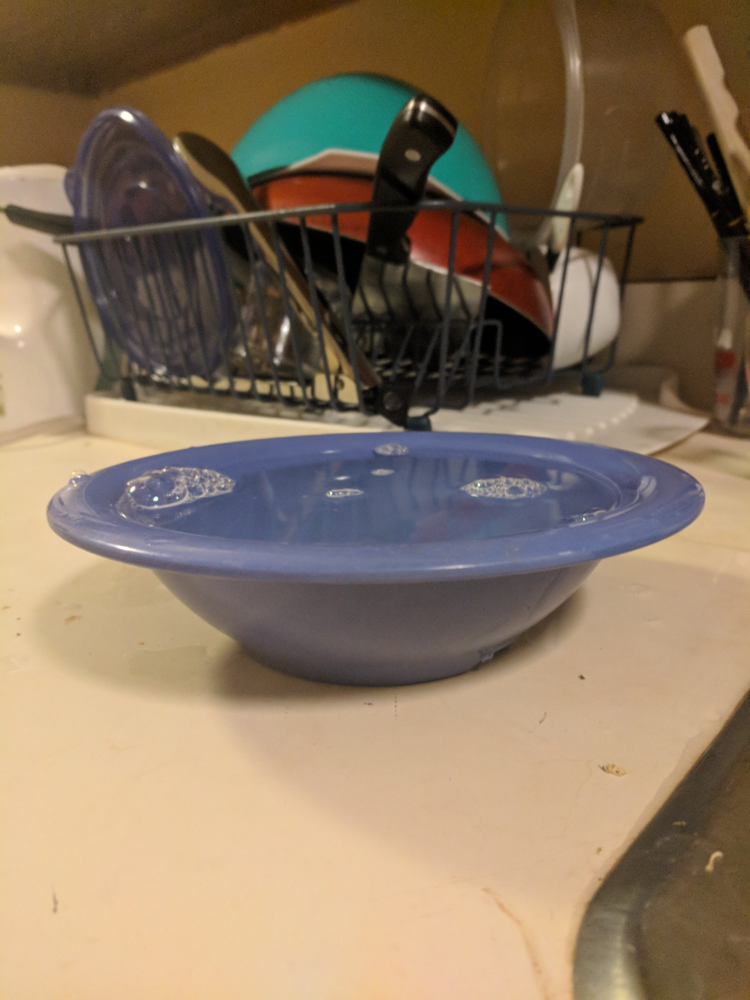

For my example of bad design, I chose the dining hall bowls. They're really frustrating to use because of their flat lip.
You can't fill one of these bowls with soup to the top, or it most definitely will spill over when you're walking around the 
dining hall with it. And the bowls themselves are so shallow, that you can't put much liquid in it at all if you don't want 
it to be all over the floor. Considering students have to put these bowls on un-sturdy trays and carry them to their table, 
it doesn't really make much sense. 

  

