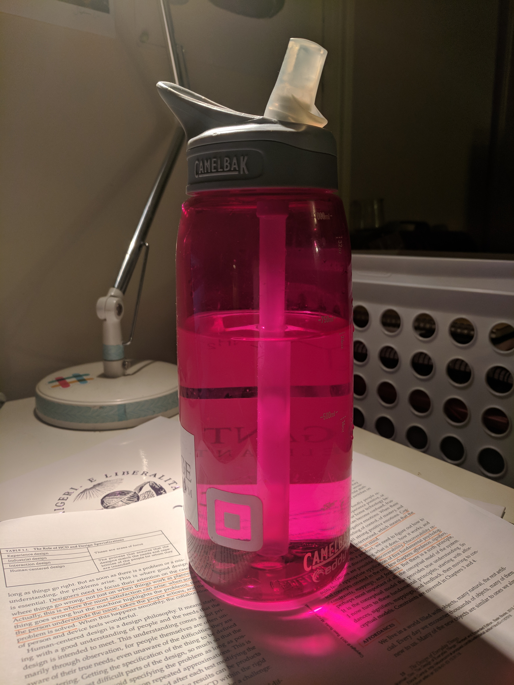
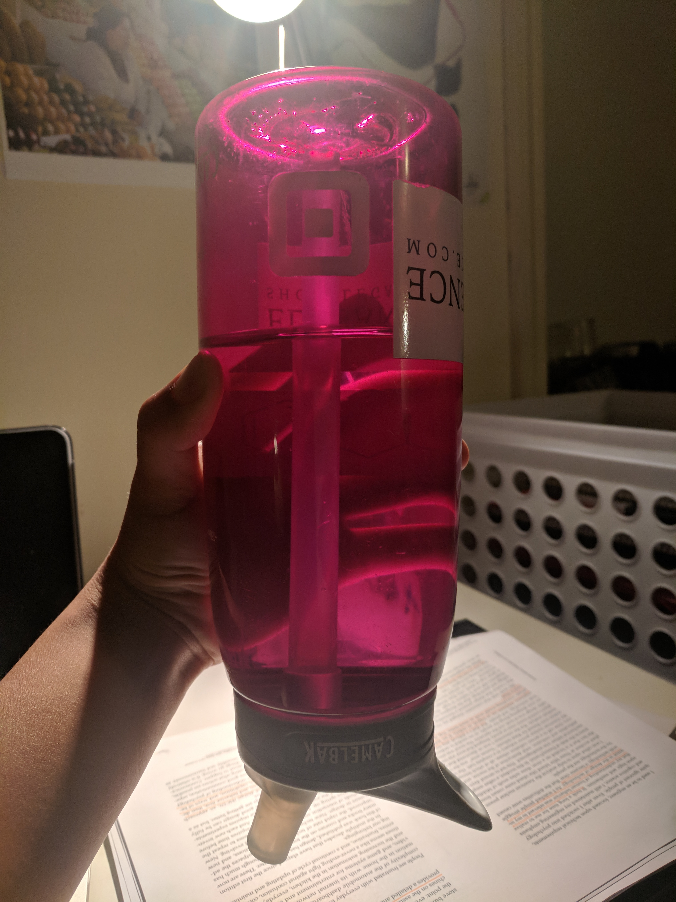

For my example of good design, I chose the Camelbak waterbottles. In contrast to most water bottles, it's just easy to take a sip without having to uncrew the cap, and then turn it upside down. You can drink from it while walking or running or riding a bike. And even while the straw is up, if it get's knocked over or someone runs into you while you're drinking from it, it won't spill! You can easily throw it in a backpack without worrying about it spilling everywhere, even though the straw is still easily accessible. 

