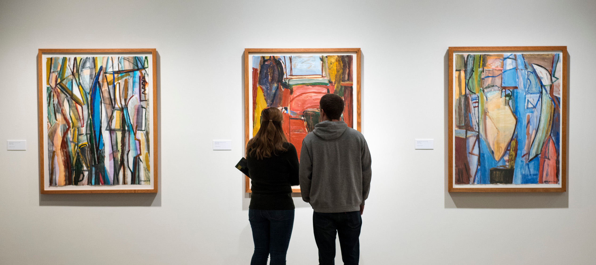

## Motivation

Art museums are undoubtedly a great way to learn about and experience art. 
A team of professional curators curate an experience for you, and push you to see the world in new ways. However, art and art museums in particular can feel intimidatingly inaccessible for the general public. For regular people, who aren't academics or involved in the "art world," art can feel elusive, out-of-touch, or even perhaps just confusing. In fact, the homogeneity of the art world is a well-documented and studied problem, where "among those who frequented art museums, a stunning 92 percent identified as white, and only 16 percent identified as a minority." 1 
There's a clear need to bring art back to the people. 

  

## Proposal

On a recent visit to MASS MoCA, I came across Tanja Hollander's "Are you really my friend?" exhibit.2 At the end of the exhibit, there's a room with a wall of post-it notes trying to answer the question "What is a true friend?". Next to the wall, there are a few sofas and desks, and a stack of post-it notes for museum-goers to add on to the collection. As I watched other people in the room sit down and scribble down thoughts, I was struck by just how accessible this exhibit was. Everyone could relate to it, and even kids were jotting down ideas and contributing to the process. My proposal builds off this idea, of making the experience of art more interactive to break down its elsuive nature. 

  

My proposal would look at new ways to interact with art by allowing users to share experiences and information about how different pieces impact them, and why.
The user could use their phone to take a picture of a piece of art (or simply type in the name), and have that 
piece of art's "profile" pulled up on their mobile device. They could then read comments from other users, make their own 
comment about their opinions, and save the piece (like a bookmark), or share it on social media. The piece of art's "profile" 
could then also offer suggestions for related artists and give more background on the artist or the inspiration for the piece. 

### Social Aspect

The "comments section" on a piece of art allows the art museum experience to move from a conversation between the curator and the museum-goer, to a conversation between "regular people." 
It allows users to learn about art through the experiences of other people, and I think that's valuable to an understanding of what art is. 
We don't want our museums to feel "stuffy" and pretentious; that's how we end up with a homogenous museum-going base. 
It also allows users to feel connected to art, by allowing them to define their individuality in finding specific pieces more 
impactful, saving those pieces, and being able to go back and look at their collection later. 

### Knowledge

I've also felt like museums don't offer quite enough information about the art. The placards and artists bios are great and very helpful, 
but most pieces themselves only have a small placard listing the artist, date, and perhaps who it was donated by. I think many 
people would "understand" art better by learning about the artist's motivations and intentions. This app would allow museum-goers to easily pull up background information about any piece of art, and thereby explore new art through a "related artists" section. The app could also offer suggestions 
based on what kinds of art the user has bookmarked, and thus allow the user to constantly explore new art even after they've left the museum. 

## Sources

1: ["Does the art world have a demographics problem?": Big Think](http://bigthink.com/Picture-This/does-the-art-world-have-a-demographics-problem)
2: ["Tanja Hollander: Are you really my friend?"] (http://massmoca.org/event/tanja-hollander/)
