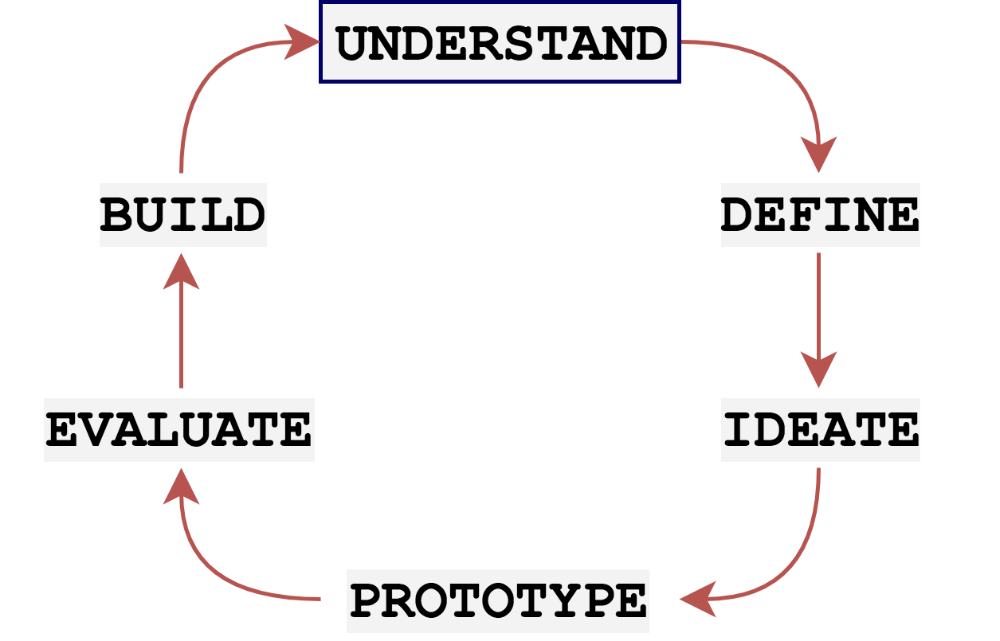

Before embarking on this semester-long journey into design thinking, I’d admittedly given very little thought to how designs come together and what the design process is really like. In my mind, it was as simple as thinking about a problem, coming up with a solution, and then implementing that solution. Now that I’ve come out the other end, there are five main guiding principles that I’ve carried with me throughout the design process that have come to define my understanding of what "design thinking" really is, or at least what it ought to include. They are: 

1. Understanding the user to understand the problem
2. Effectively communicating your ideas
3. Learning to critique and learning to take criticism
4. Designing with accessibility in mind
5. Considering the ethics of design processes and solutions

## User Understanding

<figure>
 
<figcaption> The Human-Centered Design Process. Adapted from: Norman (2013). The design of everyday things: Revised and expanded edition. Basic Books (AZ). </figcaption>
</figure>

The design process always starts with keeping an open mind, understanding your target users, and understanding the problem you’re designing for. As the above diagram suggests, *understanding* is at the heart of any human-centered design process. This means conducting thorough user research, and not letting our assumptions and preconceived ideas of what the problem *should* be cloud our understanding of what the problem that we want to design for actually *is*. 

As an example of user research, we used a combination of semi-structured interviews and contextual inquiries to first understand the problem. We interviewed a diverse group of museum-goers, as our target audience was not a specific demographic, but simply anyone interested in attending museums for the purpose of learning about art. 

We wanted to understand why people visited museums in the first place, and what they wanted to get out of going to museums, so that we could construct a design that aids them in getting the most out of their art museum experience.

We began each interview with a semi-structured interview format as outlined in *Interaction Design* by Rogers, Sharpe, and Preece (p. 229-232)[1], as they allow for both closed and open questions. Examples of questions we asked our participants at the beginning of each interview included:

> How often do you visit art museums?

> Why do you visit art museums?

> Do you usually visit art museums with others, or do you go alone sometimes?

> Do you ever research artworks or artists outside museums?

After the initial questions, we conducted contextual inquiries by observing and communicating with our participants as they walked through the museum. We asked our users to verbalize their thoughts to each other and to us to get a sense of their interactions with artworks. We employed the four basic techniques of contextual inquiries, as outlined in *Contextual Design* by Beyer and Holtzblatt[2]: interviewing in context, partnership with participants, effective interpretation of ideas, and focus.

The contextual inquiries allowed us to find concrete insights about the specific ways potential users would want to interact with artworks, and avoid generalizations. Examples of questions we asked during the contextual inquiry portions of our interviews included:

> What do you think of this piece? (Referring to some artwork in the museum)

> What else would you want to know about this piece?

> How are you choosing which exhibit to look at next?

In the end, we learned a lot about what users might want to see in an app that supports art education. For example, one surprising insight we learned is that many museum-goers would prefer to only read about specific aspects of an artworks’ background information, as too much information can distract them from developing their own personal interpretations. Formal discussions about the entire scope of our results from interviews can be found [here](http://stephanieliu.me/hciproject/design-research-results-and-themes/). 

Of course, user research doesn’t just end with the initial interviews. It became a bedrock principle throughout our design process, from defining the problem to designing the solution, to *always* keep the user’s needs in mind.

## Communication

Another key takeaway from the design process was learning to effectively communicate our ideas. Designing in the real world is never insular; it always involves many different stakeholders and participants that each have their own goals and motivations regarding the outcome of the design. 

Once we had compiled our initial user research and performed a [task analysis](http://stephanieliu.me/hciproject/task-analysis/), we decided our two main tasks would be:

1. Providing background information about artworks
2. Supporting online discussions about artworks

However, one-word sentences are ultimately vague and uninteresting. We needed to convince potential stakeholders and participants that the problem we’re addressing is compelling and the design is thus a worthwhile pursuit. 

In that end, we found scenarios and storyboards to be effective tools that would serve as more compelling communication devices. 

Scenarios allow us to tell compelling narratives about a design; they describe a design within the context of a user and their actions. As Rogers, Sharpe, & Preece note in *Interaction Design*[1], "telling stories is a natural way for people to explain what they are doing or how they achieve something." Here is the scenario we used to describe how a user might use our app to discuss an artwork through an online discussion:

> Bob has recently visited a museum and become entranced with a Jackson Pollock work. He is waiting for the bus, and thinks back to this piece. He decides he wants to discuss this particular artwork with others, so he pulls up the Art for All app and navigates to the discussion section under this artwork profile page. He asks some probing questions, and finds that another student, Sarah, is also online at the same time and wants to talk about this particular work. They discuss their interpretations, and in the end Bob feels like he has a better understanding of the artwork.

Clearly, this scenario paints a much more vivid picture of what our design intends to support and how our design would be used by a real user. It concentrates on human activity, and describes the purpose of our app in the context of why people do the things they do and what they are trying to achieve.

In a similar vein, storyboards serve as short graphical depictions of narratives that envision future scenarios of how a design interaction might serve user’s needs. As Truong et al. note in *Storyboarding: An Empirical Determination of Best Practices and Effective Guidelines*[3], "storyboards must demonstrate not only the details of a specific interface but also higher level concepts surrounding user motivation and emotion during system use." As such, we wanted our storyboards to convey an added layer of emotion and interaction between the user and the goals they were achieving with the app. The storyboard we constructed to convey the use of our design in finding background information is shown below.

<figure>
 
<figcaption>Storyboard laying out how users would use our app to find background information about artworks</figcaption>
</figure>

Scenarios and storyboards serve as only two examples of how effective communication is necessary in the design process, but they highlight how problems and solutions can be made more compelling by using emotion and examples of real users.

## Critiquing

Once the focus of our project had been fully laid out, the process of designing and evaluating the product began. In design, this is always a very iterative process.

Our design had to be constantly evaluated and critiqued by our peers in order to become the better and better at every stage. Although this concept was a bit daunting at first, we quickly learned that getting constant feedback from our peers would be the best way to use our collective knowledge as a class to our advantage. 

[Karen Cheng’s guide on "How to Survive a Critique"](http://arcadenw.org/article/how-to-survive-critique) was a helpful reference point here for those of us new to receiving critiques. We learned over the course of the semester how to not get too attached to our initial designs and how to not get defensive when bombarded with questions about it.

The first critique we did in class involved the logo design. We paired up with another team and used the I like/I wish/What if method from the Stanford design school and the "Hamburger approach" (also outlined in Cheng’s article) to constructively analyze each other’s initial logos. Even for something as small as a logo design, the critiquing approach helped us improve on our design a lot, as you can see below.

<figure>
 
<figcaption>Iterations of our logo design, after receiving critiques from our peers. A common critique of our first logo was that it was a bit bland and didn’t effectively communicate that the rectangles were supposed to be artwork frames. </figcaption>
</figure>

Once we began to think about how we might want to design the actual app, we started with sketches and paper prototypes. These kinds of "low-fidelity" prototypes allowed us to make and remake our design as many times as necessary without getting too attached to a particular design. As Buxton explains so eloquently in *Sketching User Experiences*[4]: "The role of design is to get the right design. The role of usability engineering is to get the design right."

Before putting the design in front of any potential users, we first got critiques from our peers. These critiques followed a heuristic evaluation process using Nielsen’s Usability Heuristics, found in *Usability Engineering*[5]. We got a lot of helpful insight from this process, and realized (as we often do in design) that our assumptions had played a large role in the inefficiency of our initial design.

For example, we faultily assumed that users would understand the camera symbol was for scanning QR codes, when that was not at all clear! We then modified the design to provide a one-time tutorial on the use of the QR code function, as shown below.

<figure>
 
<figcaption>Initial search screen on our paper prototype </figcaption>
</figure>

<figure>
 
<figcaption>Final digital mock-up of search by QR process, with added one-time documentation about how the QR functionality works.</figcaption>
</figure>

Receiving constructive criticism from our peers thus defined our iterative approach to "getting the design right" throughout the design process, and allowed us to make our design better at every stage. 

## Accessibility

In the latter stages of our project, it became clear that we would need to begin to address accessibility concerns as the design started coming together. As Smyk notes in [Design With Accessibility in Mind: The POUR Methodology](https://theblog.adobe.com/design-with-accessibility-in-mind-the-pour-methodology/):

> "Exclusion happens when we do not think about all the possible ways the product will be used and by whom." 

As a tool that is meant to make art more accessible to a wide audience, we definitely didn’t want to accidentally exclude large groups from using it.

For example, to address the needs of users on the autistic spectrum, we decided to break down subsections by only showing small paragraphs at a time and providing a "read more" button so that large chunks of text wouldn’t overwhelm the user. 

<figure>
 
<figcaption> Analysis section of artwork is broken down into small paragraphs at a time </figcaption>
</figure>

To address the needs of users with physical or motor disabilities, we had to increase the size of our buttons. To address the needs of users with low vision, we had to also increase the font size of our initial digital mock-up by quite a bit. 

<figure>
 
<figcaption> Increasing button sizes and font sizes </figcaption>
</figure>

Finally, we still needed to address users who are blind. This would prove to be a more difficult challenge for us, because up until then we had been focusing entirely on visual art. However, from further research we found that the art world itself has made several advances in making art accessible to the blind. The Louvre, the Guggenheim, and the MET are great examples of [museums that have established tactile tours of their galleries](https://mashable.com/2016/12/29/art-accessibility-blind-low-vision/#mc68orKeKmqJ). Although we did not have time to incorporate new features in our app at the time, we know that our app can be made much more accessible by providing information about which museums provide these kinds of tours, and providing audio versions of the background information.

## Ethics

Following good principles of ethics was an ongoing concern of ours throughout the design process. The stipulations of the ["General Moral Imperatives"](https://www.acm.org/about-acm/acm-code-of-ethics-and-professional-conduct) from the ACM Code of Ethics and Professional Conduct served as a good baseline for understanding our role and duties as designers of a new application. 

The first code of ethics we learned to keep an eye out for was citing and giving proper credit for use of others’ intellectual property. This involved citing any and all images and resources we used throughout the creation process, including those used on our project site. 

Additionally, we did not want to make our participants uncomfortable in any way during our user studies. We made sure to provide them guidelines ahead of time that stipulated what kind of recording devices we would use, explained that their identity would be kept anonymous, and explicitly told them that they could end the interview whenever they pleased if they felt uncomfortable at any point. The appendix of [this final report](http://stephanieliu.me/hciproject/understanding-to-make-final-report/) provides an example of the guidelines we gave to participants in our usability studies. 

Regarding the actual implementation of our app, we decided that users would be allowed to remain entirely anonymous to alleviate any potential of publicizing personally identifiable information. 

However, we would also have to develop solutions to prevent harassment and intolerant or hate speech. We want to make sure that our app does not pose any harm to users in any way. 

One of the main ways we could combat hate speech would be to involve museum staff and curators in the process, and allow them to moderate and flag abusive content. Moderators would also be given full discretion to block certain accounts from posting if they found repeated offenses. Users would also be allowed to flag any content they thought was unacceptable, and moderators could then pull up all flagged content and choose to allow or disallow certain posts. 

Being ethical designers thus meant always keeping an eye out for the potential harms our design process or our product could impart, and addressing them before they arise.

## Main Takeaways

As an undeniable newcomer in the design world, I’ve found that these principles have shaped my understanding of design thinking throughout the semester. They are the methods, processes, and skills I plan to take with me in any future endeavor that relies on finding solutions to problems. **User understanding** means that the problem isn’t defined when you first think of an idea; you still need to spend time understanding your users to really understand the problem. **Effective communication** means learning to successively communicate to others that this problem is worth spending time on. **Critiquing** means not getting too attached to your ideas, and allowing yourself and your design to be flexible. **Accessibility** means designing for everyone, not just the portion of the population that behaves the way you do. Finally, **ethics** means always thinking about the potential harms of the design process and the design solutions, and working to prevent harm whenever possible. These are the salient points of the design process that I will take with me in any future design projects.

## Citations

1. Rogers, Sharpe, & Preece. Interaction Design. Wiley, 2015.
2. Holtzblatt, Karen, and Hugh Beyer. Contextual Design. Morgan Kaufmann, 2017.
3. Truong, Hayes, & Abowd. 2006. Storyboarding: an empirical determination of best practices and effective 
guidelines. In Proceedings of the 6th conference on Designing Interactive systems (pp. 12-21). ACM.
4. Buxton, Bill. Sketching User Experiences: Getting the Design Right and the Right Design. Morgan Kaufmann, 2007.
5. Nielsen, Jakob. Usability Engineering. Academic Press, 1993.

